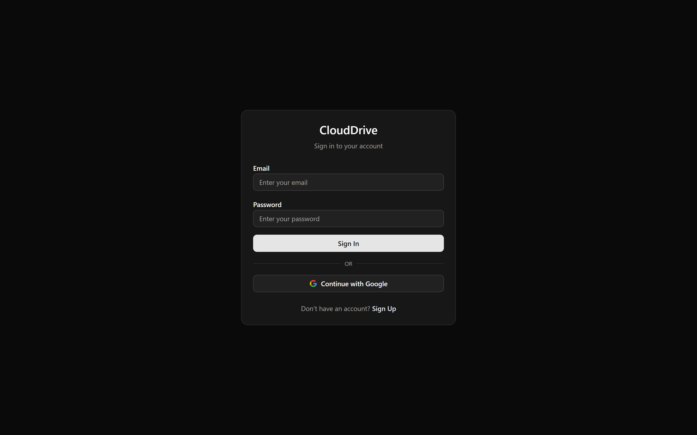
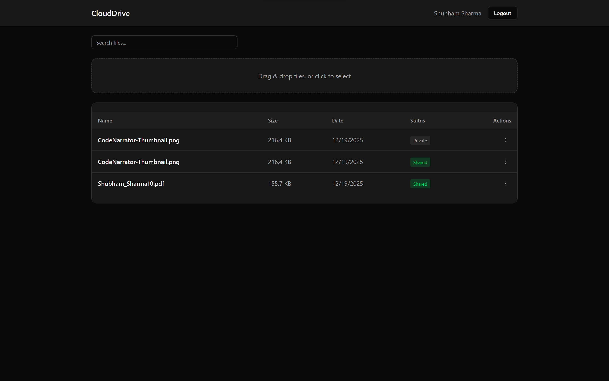
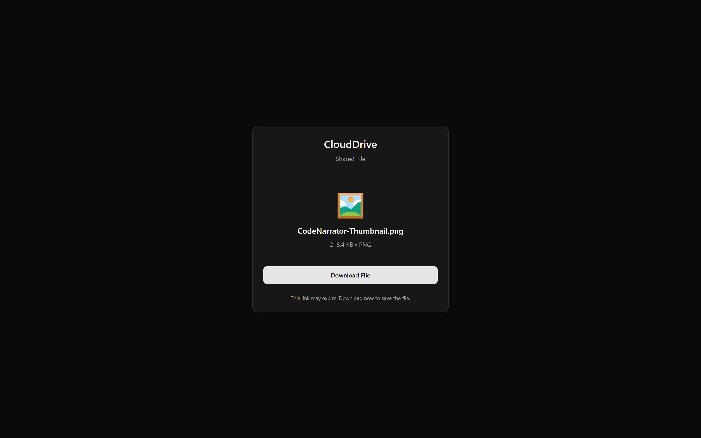

# ☁️ CloudDrive - Google Drive Clone

A full-stack cloud storage application with file upload, download, sharing, and Google OAuth authentication.


---

## ✨ Features

- **User Authentication**
  - Email/Password registration & login
  - Google OAuth 2.0 integration
  - JWT-based session management

- **File Management**
  - Upload files to AWS S3
  - Download files via signed URLs
  - Rename and delete files
  - Search files by name

- **File Sharing**
  - Generate shareable public links
  - Revoke shared access anytime
  - Public file access without login

---

## 📸 Screenshots

### Login Page


### Dashboard


### File Sharing


---

## �🛠️ Tech Stack

| Layer | Technology |
|-------|------------|
| Frontend | React, TypeScript, Vite, Tailwind CSS, Shadcn UI |
| Backend | Node.js, Express, TypeScript |
| Database | MongoDB (Mongoose ODM) |
| Storage | AWS S3 |
| Auth | JWT, Passport.js (Google OAuth) |
| DevOps | Docker, Docker Compose |

---

## 📁 Project Structure

```
CloudDrive/
├── backend/
│   ├── src/
│   │   ├── config/           # DB, S3, Passport config
│   │   ├── controllers/      # Route handlers
│   │   ├── middlewares/      # Auth middleware
│   │   ├── model/            # Mongoose schemas
│   │   ├── routes/           # API routes
│   │   └── index.ts          # Express app
│   ├── Dockerfile
│   ├── .dockerignore
│   ├── .env                  # Environment variables
│   └── package.json
│
├── frontend/
│   ├── src/
│   │   ├── api/              # API client functions
│   │   ├── components/       # UI components (Shadcn)
│   │   ├── context/          # Auth context
│   │   ├── page/             # Page components
│   │   └── App.tsx           # Main app with routing
│   ├── Dockerfile
│   ├── .dockerignore
│   ├── vercel.json           # Vercel SPA routing
│   └── package.json
│
├── docker-compose.yml
├── .env                      # Docker environment variables
├── .env.example              # Template for env vars
└── README.md
```

---

## 🚀 Getting Started

### Prerequisites

- Node.js 22+
- MongoDB (local or Atlas)
- AWS Account with S3 bucket
- Google Cloud Console project (for OAuth)
- Docker (optional)

---

### Option 1: Local Development (Without Docker)

#### 1. Clone the Repository

```bash
git clone https://github.com/shubhamsharma-10/CloudDrive.git
cd CloudDrive
```

#### 2. Backend Setup

```bash
cd backend
npm install
```

Create `backend/.env`:

```env
PORT=3000
MONGODB_URL=mongodb://localhost:27017/google_drive
JWT_SECRET=your-jwt-secret-key
SESSION_SECRET=your-session-secret
CLIENT_URL=http://localhost:5173
GOOGLE_CLIENT_ID=your-client-id.apps.googleusercontent.com
GOOGLE_CLIENT_SECRET=GOCSPX-your-secret
GOOGLE_CALLBACK_URL=http://localhost:3000/api/auth/google/callback
AWS_ACCESS_KEY_ID=your-aws-key
AWS_SECRET_ACCESS_KEY=your-aws-secret
AWS_REGION=us-east-1
AWS_S3_BUCKET_NAME=your-bucket-name
```

Start backend:
```bash
npm run dev
```

#### 3. Frontend Setup

```bash
cd frontend
npm install
npm run dev
```

#### 4. Access the app

- Frontend: `http://localhost:5173`
- Backend API: `http://localhost:3000/api`

---

### Option 2: Docker Setup

#### 1. Create `.env` file in root

```env
MONGODB_URL=mongodb://host.docker.internal:27017/google_drive
JWT_SECRET=your-jwt-secret-key
SESSION_SECRET=your-session-secret
GOOGLE_CLIENT_ID=your-client-id.apps.googleusercontent.com
GOOGLE_CLIENT_SECRET=GOCSPX-your-secret
AWS_ACCESS_KEY_ID=your-aws-key
AWS_SECRET_ACCESS_KEY=your-aws-secret
AWS_REGION=us-east-1
AWS_S3_BUCKET_NAME=your-bucket-name
```

> **Note:** Use `host.docker.internal` instead of `localhost` for MongoDB

#### 2. Docker Commands

| Command | Description |
|---------|-------------|
| `docker-compose build` | Build images only |
| `docker-compose up` | Start containers |
| `docker-compose up --build` | Build and start |
| `docker-compose up -d` | Start in background |
| `docker-compose down` | Stop containers |
| `docker-compose logs -f` | View logs |

#### 3. Run the app

```bash
docker-compose up --build
```

- Frontend: `http://localhost:5173`
- Backend: `http://localhost:3000`

---

## ☁️ Deployment

### Deploy Backend to Render

1. Go to [render.com](https://render.com) → New Web Service
2. Connect your GitHub repository
3. Configure:
   - **Root Directory:** `backend`
   - **Build Command:** `npm install && npm run build`
   - **Start Command:** `npm run start`
4. Add Environment Variables (all from `.env`)
5. Deploy

### Deploy Frontend to Vercel

1. Go to [vercel.com](https://vercel.com) → Import Project
2. Select your repository
3. Configure:
   - **Root Directory:** `frontend`
   - **Build Command:** `npm run build`
   - **Output Directory:** `dist`
4. Add Environment Variable:
   ```
   VITE_API_BASE_URL=https://your-backend.onrender.com/api
   ```
5. Deploy

### Update Google OAuth for Production

1. Go to [Google Cloud Console → Credentials](https://console.cloud.google.com/apis/credentials)
2. Edit your OAuth 2.0 Client
3. Add:
   - **Authorized JavaScript origins:** `https://your-frontend.vercel.app`
   - **Authorized redirect URIs:** `https://your-backend.onrender.com/api/auth/google/callback`
4. Save and wait 1-2 minutes

---

## 📡 API Endpoints

### Authentication

| Method | Endpoint | Description |
|--------|----------|-------------|
| POST | `/api/auth/register` | Register new user |
| POST | `/api/auth/login` | Login user |
| GET | `/api/auth/me` | Get current user |
| GET | `/api/auth/google` | Google OAuth login |
| GET | `/api/auth/google/callback` | OAuth callback |

### Files

| Method | Endpoint | Description |
|--------|----------|-------------|
| GET | `/api/files` | Get all user files |
| POST | `/api/files/upload` | Upload a file |
| GET | `/api/files/search?query=` | Search files |
| PUT | `/api/files/:id/rename` | Rename file |
| DELETE | `/api/files/:id` | Delete file |
| GET | `/api/files/:id/download` | Get download URL |
| POST | `/api/files/:id/share` | Enable sharing |
| POST | `/api/files/:id/unshare` | Disable sharing |
| GET | `/api/files/shared/:token` | Get shared file |

---

## 🧪 Testing the Application

1. **Register/Login** with email or Google
2. **Upload** a file using drag-and-drop or click
3. **Search** files using the search bar
4. **Rename** a file from the dropdown menu
5. **Share** a file and copy the public link
6. **Access** shared file (works without login)
7. **Download** files directly
8. **Delete** files from the dropdown menu

---

## 🔐 Google OAuth Setup

1. Go to [Google Cloud Console](https://console.cloud.google.com/)
2. Create a new project
3. Enable **Google+ API**
4. Go to **Credentials** → **Create Credentials** → **OAuth Client ID**
5. Add authorized redirect URI:
   ```
   http://localhost:3000/api/auth/google/callback
   ```
6. Copy Client ID and Secret to `.env`

---

## 📝 License

MIT License

## 👤 Author

**Shubham Sharma**

- GitHub: [@shubhamsharma-10](https://github.com/shubhamsharma-10)
